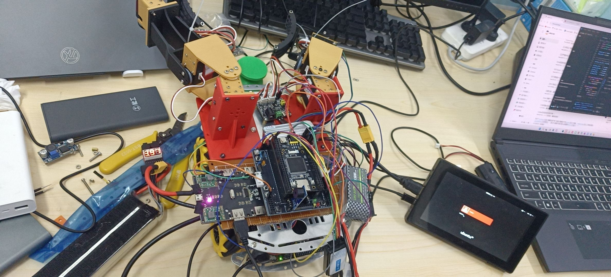

# 02｜haimichenha｜底盘控制与整机联调

**负责人：haimichenha**

本模块是 STM32 底盘、四轮/麦轮驱动、总线舵机、蓝牙遥控和 Nano 串口联调的工程入口。完整 CMake/STM32 工程整体位于 `firmware/`，其内部相对目录关系保持不变。

## 固件入口与相关模块

| 位置 | 用途 |
| --- | --- |
| [firmware/Src/main_bluetooth_car_arm.c](firmware/Src/main_bluetooth_car_arm.c) | 双臂小车蓝牙控制与总线舵机动作组入口；文件头注明蓝牙 USART3 与总线舵机 UART4 的测试配置。 |
| [firmware/Hardware/app_bluetooth_motor_test.c](firmware/Hardware/app_bluetooth_motor_test.c) | 蓝牙电机控制逻辑。 |
| [firmware/Hardware/app_servo_test.c](firmware/Hardware/app_servo_test.c) | 总线舵机动作与命令处理。 |
| [firmware/Hardware/app_nano_uart_test.c](firmware/Hardware/app_nano_uart_test.c) | STM32 与 Nano 的 UART 联调接口。 |
| [硬件接口与引脚台账](硬件接口与引脚台账.md) | 引脚、串口与模式冲突的记录。 |
| [验收复盘与报告素材](验收复盘与报告素材.md) | 四轮 TT 电机开环方向测试、L298N 两路扩展、总线舵机动作组、蓝牙与上电故障复盘的同源 Markdown 伴随页。 |
| [开发历程与调试复盘](开发历程与调试复盘.md) | 从 Nano 串口排噪、四轮 PWM 标定、舵机动作组到蓝牙整合的过程、检查点与结论边界。 |

不同 `main_*.c` 对应不同测试目标；编译或烧录前只选择一个入口，并检查其外设初始化与当前接线一致。

```powershell
Set-Location .\firmware
cmake --preset BluetoothCarArmDebug
cmake --build --preset BluetoothCarArmDebug
```

## 硬件与验收资料

| 文件 | 说明 |
| --- | --- |
| [小车 PCB 原理图展示](hardware/小车pcb原理图展示.pdf) | 已归档的 PCB 原理图展示；具体接线仍以实物和选定固件入口为准。 |
| [四电机测试照片](evidence/小车四电机测试第一.jpeg) | 驱动器、电机和线束已接入测试工装的阶段记录。 |
| [整车接线完成照片](evidence/小车接线完成第二.jpeg) | 整车主要接线完成后的联调状态。 |
| [教师验收视频](evidence/小车验收视频.mp4) | 540×960、30 fps、约 41.63 s 的教师验收实物记录。 |

照片和视频用于记录阶段状态；四轮方向、闭环质量、成功率和精度等结论仍需对应测试日志或验收判据。

## 验收焦点与证据边界

本模块的可复核亮点集中在四轮 TT 电机的**开环方向调试**、后轮 L298N
两路扩展、总线舵机动作组与蓝牙指令链路。完整参数、来源状态和已发现的
版本冲突见[验收复盘与报告素材](验收复盘与报告素材.md)。其中开环方向记录
不能替代编码器闭环、速度精度或整车路径性能结论。

整车、底盘和机械臂的三维结构由赵正杰使用 **SolidWorks** 建模；可编辑的
装配/零件源与 SolidWorks 装配视图位于[机械建模与装配模块](../01_赵正杰_机械建模与装配/README.md)。
`SLDASM`、`SLDPRT` 是建模源文件，`STL`、`3mf` 仅是制造导出物。




## 开发历程速览

| 阶段 | 形成的可复用经验 |
| --- | --- |
| Nano 串口 | 先处理 TX/RX 交叉、共地与端口占用，再做 PING/ECHO/VISION；不要把乱码误判成视觉协议问题。 |
| 四轮底盘 | 先隔离单轮、驱动公共使能和供电，再调 PWM；以短脉冲与轮侧补偿降低整车调参风险。 |
| 总线舵机 | 先确认 `#IIIPPPPPTTTT!` 发送链路、独立供电和共地，再把六轴姿态表接入蓝牙动作组。 |
| 控制接口 | 陀螺仪/LADRC 仅保留诊断与后续闭环接口，不能把“有算法模块”写成“已经完成闭环”。 |

具体时间线、历史问题定位和验证边界见[开发历程与调试复盘](开发历程与调试复盘.md)。
