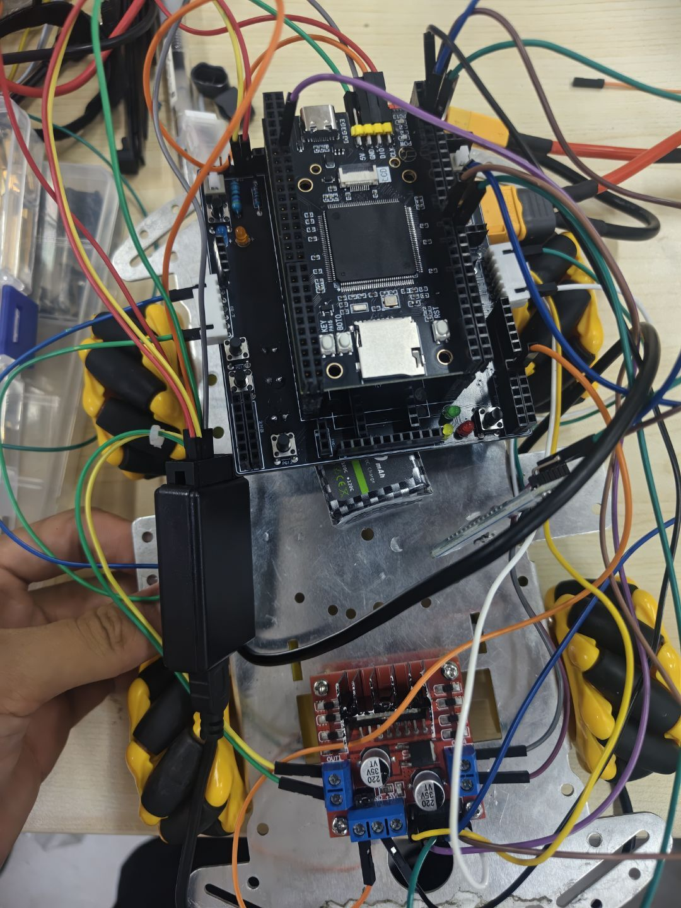

# 开发历程与调试复盘

> 本页把项目负责人的历史调试会话与仓库内保留的代码、日志合并为可阅读的开发历程。
> 会话来源为用户指定的 `codex://threads/019f5f90-524e-70c3-a17d-1f7019c779bc`，它是
> 私有历史记录，不能作为 GitHub 可访问链接；每项结论均标出可公开复核的仓库文件或
> “历史调试记录/用户确认”状态。本页只描述双臂小车短学期项目。

<details open>
<summary><strong>阅读导航</strong> · 先读结论与时间线，再按问题展开</summary>

- [阶段结论与证据边界](#journey-boundary)
- [时间线与检查点](#journey-timeline)
- [Nano 串口排错](#journey-nano)
- [四轮底盘与短脉冲](#journey-drive)
- [总线舵机发包](#journey-servo)
- [蓝牙按键隔离与算法接口](#journey-control)
- [上电故障与资料索引](#journey-safety)

**建议学习路径：** 先看前两节建立全局，再从自己遇到的“通信 / 轮子不动 / 舵机无动作 /
蓝牙误触”展开对应卡片。每个折叠块都保留来源与“不可扩大为”的边界。
</details>

<a id="journey-boundary"></a>
## 1. 先给出结论边界

这台车的开发不是一次性把所有模块接上，而是按“**物理链路 → 单模块 → 整车短脉冲 →
蓝牙动作组**”逐层收敛：

1. 先让 STM32 与 Nano 的 UART5 在电机、舵机断电条件下互通；
2. 再分离前后轮驱动、方向极性和单轮起转门槛；
3. 用 UART4 的六路姿态帧验证舵机动作；
4. 最后把短脉冲底盘命令和手机多字节动作按键接到同一入口。

其中“**电机可控**”是基于开环 PWM、短时间脉冲和人工观察的阶段结论；项目没有留下
编码器闭环速度、轨迹精度或完整 LADRC/LQR 实车闭环证据。算法模块是后续接口与日志
准备，不能反向写成性能验收结果。

<a id="journey-timeline"></a>
## 2. 时间线与检查点

| 阶段 | 现场问题与采取动作 | 形成的结果 / 证据状态 |
| --- | --- | --- |
| 2026-07-14：Nano UART5 首测 | 初始收到乱码、噪声和溢出，未先把它归因于视觉程序；重新核对 TX/RX 交叉、共地、3.3 V 电平与 Nano 端口占用。 | 修正为 `PC12=MCU TX`、`PD2=MCU RX` 后，历史实测 PING/PONG 为 15/15，ECHO_ACK 与 VISION_ACK 均为 3/3，串口错误计数为 0。配置见[UART5 交接记录](firmware/logs/nano_uart_test_handoff_20260714.md)；通过结果为历史调试记录。 |
| 2026-07-14：蓝牙与前轮故障隔离 | 已观察到有效蓝牙字节但右前、随后前轮均不动；没有直接把问题归为“蓝牙失效”，而是检查 TB6612 的公共 `STBY`、`VM`、地线、驱动通道和电机/线束互换。 | 确立“命令遥测正常不等于电机已转”的排查顺序；前轮接口与后轮 L298N 扩展见[引脚台账](硬件接口与引脚台账.md)。历史调试记录。 |
| 2026-07-14：单轮方向与 PWM 补偿 | 左、右前轮先后出现起转弱或方向相反；先提高/降低单轮 PWM，再修正左前极性，最后缓存可用底盘版本。 | 后续电机逻辑保留轮侧补偿和零速关断；架空方向证据见[电机接线记录](firmware/logs/motor_wiring_known_good_20260712.md)。 |
| 2026-07-14：UART4 舵机 | 初次完整发帧但机械臂未动作，改为分别检查 `PC10→RX`、`PC11←TX`、共地、独立舵机电源和 115200 8N1；避免盲改姿态表。 | 发送链路完成 INITIAL、GRAB、OPEN、LIFT、LOWER、STACK 六姿态共 36 帧；动作组当前参数见[验收复盘页](验收复盘与报告素材.md)。发帧日志为历史调试记录，动作执行由用户现场确认。 |
| 2026-07-15：重载底盘 PWM 扫描 | 10% 仅有动静但未稳定起步，依次考察 12%、15%、18%、25% 原始 PWM，并把单次动作由 1200 ms 缩到 300 ms、再缩到约 285 ms。 | 形成短脉冲调试法：减少一次按键位移，便于人工比较前后、左右动作。18% / 285 ms 的多轮序列为历史调试记录，不是通用电机参数。 |
| 2026-07-15：蓝牙整合 | 为避免手机方向键与机械臂按键互相误触，把小写多字节负载先完整匹配，再执行舵机动作；同一方向键长按按短脉冲重复。 | 当前源码保留 `285 ms` 动作脉冲、`80 ms` 间隔、左侧 +5% 补偿及动作序列解析；详见[蓝牙电机逻辑](firmware/Hardware/app_bluetooth_motor_test.c) 和[蓝牙车臂入口](firmware/Src/main_bluetooth_car_arm.c)。 |
| 2026-07-15：陀螺仪 / LADRC 预研 | PWM 扫描期间 WIT 姿态帧仍为 0，故没有把偏航计算直接接入电机输出。 | [app_ladrc.c](firmware/Hardware/app_ladrc.c) 当前只以测量值计算限幅建议输出，未实现 ESO/TD，也不改写 `Mecanum_SetWheel()`；属于诊断接口，非闭环控制。 |

<a id="journey-nano"></a>
<details>
<summary><strong>3. Nano 串口：先消除物理噪声，再谈视觉协同</strong> · 展开通信排错与分阶段验证</summary>

### 3.1 排查路径

首次日志中的非 ASCII 字节、帧错和溢出说明“端口已打开”并不等于“协议已通”。调试时
先隔离了电机与舵机电源，再检查以下四项：

| 检查项 | 已固定的做法 | 目的 |
| --- | --- | --- |
| 线序 | Nano J41 `TX → PD2`，`RX ← PC12` | 避免 TX-TX / RX-RX 直连。 |
| 地与电平 | 双端共地，只用 3.3 V TTL，不接双方 5 V | 消除无共同参考地或电平不匹配。 |
| Nano 端口 | 直连 J41 使用 `/dev/ttyTHS1` 前先检查 `nvgetty`；不把内核控制台端口当业务 UART。 | 防止系统服务占用导致“程序能运行、数据不通”。 |
| 协议顺序 | `STM32_READY` → PING/PONG → ECHO → VISION_ACK | 先证实低速文本帧，再进入视觉消息。 |

仓库中的[UART5 交接记录](firmware/logs/nano_uart_test_handoff_20260714.md)保留了接线图、
文本协议和阶段门槛。历史实测在修正接线后得到 PING/PONG 15/15、ECHO_ACK 3/3、
VISION_ACK 3/3，且解析/溢出/硬件错误均为 0；该数值目前来自私有调试会话，尚未附上
对应原始 CSV 到本仓库。

### 3.2 经验沉淀

- 不在乱码状态下调 YOLO 或控制策略；先以低速 PING/ECHO 判断是否是物理 UART 问题。
- 日志中保留 `parse_err`、`overflow`、`uart_pe/fe/ne/ore`，比只看“有没有打印字符”可靠。
- W0–W4 分阶段（逻辑电源、低速文本、异常输入、合成视觉、真实视觉）使通信故障不会被
  误判成底盘或视觉故障。

</details>

<a id="journey-drive"></a>
<details>
<summary><strong>4. 四轮底盘：从“轮子不动”到可重复的短脉冲</strong> · 展开硬件隔离与 PWM 调参过程</summary>

### 4.1 先定位驱动链，再调占空比

蓝牙字节已在 STM32 诊断端出现而前轮不动时，排查顺序转向了硬件：

1. 对调电机线束，区分电机/线束故障与固定驱动通道故障；
2. 前轮同时无动作时，优先检查 TB6612 共享的 `STBY=PE6`、`VM` 和公共地，而非假设两只
   电机同时损坏；
3. 后轮按 L298N 的 ENA/ENB 和 IN1–IN4 单独检查；
4. 只在方向、电源和通道已确认后，对起转弱的轮子做 PWM 补偿。

这一顺序留下了实际接口和单轮方向记录：[硬件接口与引脚台账](硬件接口与引脚台账.md)、
[电机接线已知记录](firmware/logs/motor_wiring_known_good_20260712.md)。它也解释了为什么
项目把“寄存器有 PWM”与“轮子已正确运动”明确分开。

### 4.2 从长动作改为短脉冲

重载整车的早期 1200 ms 测试不利于观察小差异，于是调试按 10% → 12% → 15% → 18% →
25% 的原始 PWM 逐级观察，并将持续时间缩短为约 300 ms、再到 285 ms。随后对每个方向
做多次脉冲和间隔比较，而非用一次大幅动作给出结论。

当前 [app_bluetooth_motor_test.c](firmware/Hardware/app_bluetooth_motor_test.c) 体现的是该
思路的代码化结果：基础右侧行驶值为 14%、左侧额外补偿 5%、右侧转向基值为 8%、每次
动作 285 ms，动作间隔至少 80 ms。它仍受 `BLUETOOTH_MOTOR_OUTPUT_ENABLE` 构建开关控制；
默认源码为预览输出，不应把这些数字直接写成“当前实车正在运行的最终参数”。



</details>

<a id="journey-servo"></a>
<details>
<summary><strong>5. 总线舵机：动作表与安全发包</strong> · 展开帧格式、排错与姿态发包方法</summary>

舵机控制使用 UART4（PC10=TX、PC11=RX，115200 8N1）。控制器接收 ASCII 动作帧：

```text
#IIIPPPPPTTTT!
```

- `III` 为三位舵机 ID（000–005）；
- `PPPP` 是目标位置；`TTTT` 是毫秒单位的动作时长；
- `#`、`P`、`T`、`!` 是帧格式符，不需要额外校验和或固定 CR/LF。

首次“发帧但机械臂不动”后，没有改变动作数组，而是先检查控制板 RX/TX、共地、独立电源
和串口速率。稳定后，测试程序按 INITIAL → GRAB → OPEN → LIFT → LOWER → STACK 逐姿态
发出 6×6 帧；当前每帧 1500 ms、相邻帧间隔 3 ms，完整姿态之间按测试策略留出 2500 ms。
位置数组、`LOWER` 的版本差异和手机动作映射见[验收复盘与报告素材](验收复盘与报告素材.md)。

</details>

<a id="journey-control"></a>
<details>
<summary><strong>6–7. 蓝牙动作组与算法接口</strong> · 展开按键隔离、长按短脉冲和 LADRC/LQR 边界</summary>

### 6. 蓝牙动作组：不让两类按键相互干扰

底盘方向使用大写/单字节兼容命令，机械臂使用手机按键发出的**小写多字节负载**。入口先
检查完整负载，再把它转换为单个舵机姿态命令：

| 手机负载 | 转换后的姿态 | 设计目的 |
| --- | --- | --- |
| `zq` | `G` / GRAB | 不能把其中的 `q` 当作原地转向。 |
| `fk` | `O` / OPEN | 不能把其中的 `f`、`k` 当作前进/后退。 |
| `jql` | `U` / LIFT | 先收全序列再执行。 |
| `fyd` | `D` / LOWER | 使用当前源码的 LOWER 参数。 |
| `dj` | `K` / STACK | 与底盘 `J` 键隔离。 |
| `hdcs` | `I` / INITIAL | 只在完整小写序列匹配时执行。 |

长按同一方向键不把电机持续保持在高 PWM，而是在一次短脉冲完成并经过停止间隔后再触发。
这让现场人员可以用同一蓝牙界面做细小位移调整；停止命令仍应直接断开电机输出。具体命令
和输出开关边界以[蓝牙方向测试计划](firmware/logs/bluetooth_mecanum_test_plan_20260713.md)
与选定编译入口为准。

### 7. 算法接口：已实现什么，尚未实现什么

| 内容 | 当前仓库可复核状态 | 不应写成 |
| --- | --- | --- |
| WIT 陀螺仪接口 | 已有 UART 解析、Yaw 读取和 PWM 扫描入口。 | 已完成实车姿态闭环。 |
| `app_ladrc` | 将目标/测量偏差按比例计算并限幅到 ±30%，可供日志观察。 | 已有完整 TD、ESO 和扰动补偿的 LADRC。 |
| LQR 规划 | SolidWorks 装配可为质量、惯量、几何参数的后续建模提供来源。 | 已完成机械臂 LQR 控制或实车验证。 |
| 分层解耦 | 底盘短脉冲、舵机姿态和算法诊断接口相互隔离。 | 多系统已形成闭环自治。 |

这项边界来自当时的实际调试决策：陀螺仪未取得有效姿态帧时，LADRC 的输出仅记录，不直接
写入四轮 PWM。这样避免以未校验的符号、噪声或模型误差破坏已可用的人工蓝牙底盘基线。

</details>

<a id="journey-safety"></a>
<details>
<summary><strong>8–9. 上电故障复盘与公开资料索引</strong> · 展开复测门槛和可追溯资料</summary>

### 8. 上电故障复盘与后续复测

用户确认，组装后曾发生 PCB 主地线断开，整车上电时 STM32F103ZET6 异常发热并损坏。该
事件说明驱动调参之前，电源与回流路径必须先通过最小检查；它目前缺少公开的万用表截图、
维修记录或复上电日志，因此只能作为**用户确认的故障经历**，不能宣称已完全修复。

下一次复测建议按以下顺序留存材料：

1. 断电测主地到 STM32、TB6612、L298N、舵机电源和蓝牙模块地的连续性；
2. 仅上 MCU 逻辑电源，记录电压和静态温升；
3. 车架架空，逐轮做低占空比正反转；
4. 单独检查 UART5 PING/ECHO 与 UART4 的无负载姿态；
5. 最后再做手机端短脉冲行驶和动作组联调。

### 9. 公开资料索引

| 资料 | 支持的内容 |
| --- | --- |
| [硬件接口与引脚台账](硬件接口与引脚台账.md) | 物理引脚、混合驱动配置、上电检查。 |
| [验收复盘与报告素材](验收复盘与报告素材.md) | 动作数组、SolidWorks 结构、图片及报告边界。 |
| [Nano UART5 交接记录](firmware/logs/nano_uart_test_handoff_20260714.md) | 接线、文本协议、阶段门槛与安全测试路径。 |
| [电机接线已知记录](firmware/logs/motor_wiring_known_good_20260712.md) | 四轮方向极性与 L298N/TB6612 快照。 |
| [蓝牙/舵机测试计划](firmware/logs/servo_bluetooth_test_plan_20260713.md) | UART 分配、姿态基线、单动作测试顺序。 |
| [SolidWorks 机械建模与装配](../01_赵正杰_机械建模与装配/README.md) | 整车、底盘、机械臂的可编辑三维设计源。 |

> 若要把本页写进正式报告，应在“开发历程/问题复盘”章节引用其过程，而把方向、通信和
> 动作结论回链到各自的日志、代码或现场照片；不要只凭本页叙述生成成功率、精度或闭环
> 性能数据。
</details>
