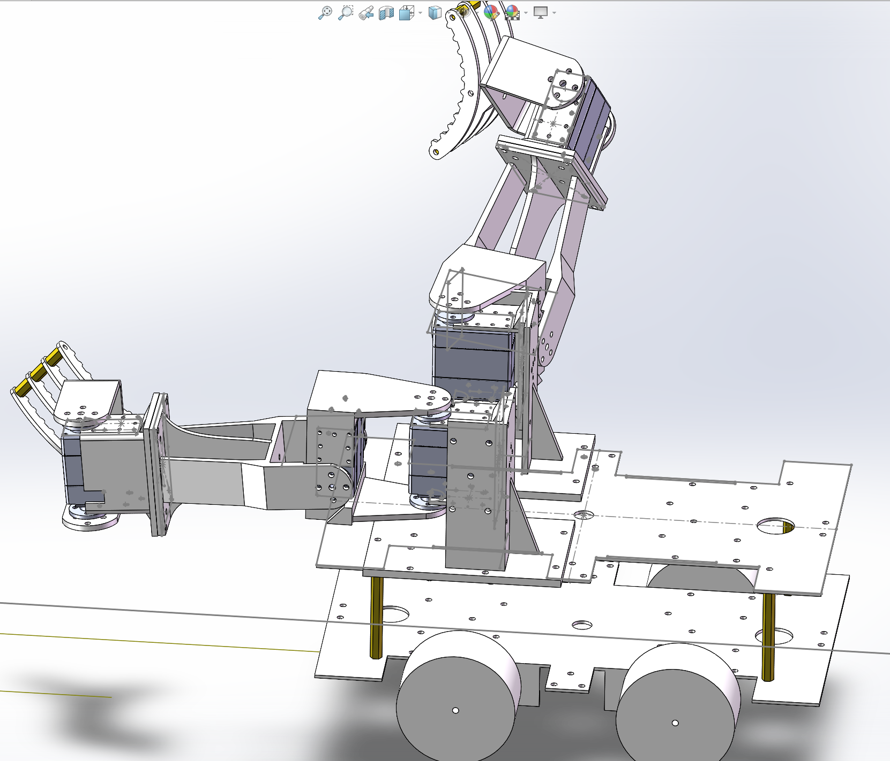

# 短学期验收复盘与报告素材

> 这是“02｜haimichenha｜底盘控制与整机联调”的 GitHub Markdown 伴随页，用于快速
> 阅读、验收复核和后续报告取材；它不是另一套固件说明，也不替代正式 Word 报告。
> 本页只覆盖双臂小车短学期项目，不适用于同工作区的电赛陆空无人机项目。

<strong>阅读导航</strong> · 先读事实边界，再按报告章节展开

- [SolidWorks 三维结构](#report-cad)
- [可写入报告的事实与边界](#report-evidence)
- [四轮 TT 电机与 L298N](#report-motor)
- [六轴动作数组与版本差异](#report-servo)
- [蓝牙动作组与上电复测](#report-control)
- [引用与待补证据](#report-follow-up)

**阅读提示：** 默认展开的是结构、证据边界和电机快照；完整动作参数、蓝牙映射及复测清单
收在折叠块中，写报告或复现实物时再打开即可。

## 0. SolidWorks 三维结构与装配

双臂小车的整机、底盘和机械臂三维结构由赵正杰（赵总）使用 **SolidWorks** 完成；
它是可编辑的 `SLDASM` / `SLDPRT` 设计，不应笼统表述为“3D 打印模型”。打印用的
`STL`、`3mf` 只是从建模源导出的制造文件。详细源文件与结构说明见
[机械建模与装配模块](../01_赵正杰_机械建模与装配/README.md)。

该视图证明设计与装配关系已建模，不直接证明实物运动性能、舵机力矩或抓取重复性。

## 1. 可写入报告的工程事实与证据状态

| 主题 | 可核查事实 | 来源与状态 | 报告中不可扩大为 |
| --- | --- | --- | --- |
| 四轮 TT 电机 | 使用单轮、架空、定时的开环方向检查；后轮由 L298N 扩展两路。 | [电机接线已知记录](firmware/logs/motor_wiring_known_good_20260712.md)；用户确认。 | 编码器闭环、速度精度、循迹能力或长期可靠性。 |
| 四驱接口 | 前轮 TB6612、后轮 L298N 的 PWM 与方向电平已有一次物理检查记录。 | [硬件接口与引脚台账](硬件接口与引脚台账.md)；日志记录。 | 任意 `main_*.c` 都可直接复用这一接线。 |
| 三维结构 | 整机、底盘和机械臂以 SolidWorks 装配/零件文件维护，打印文件从建模源导出。 | [机械建模与装配模块](../01_赵正杰_机械建模与装配/README.md)。 | CAD 视图本身证明动态性能或实物装配最终状态。 |
| 双臂动作组 | 六个总线舵机按 ID 0–5 发送位置数组；每个位置帧当前为 1500 ms。 | [app_servo_test.c](firmware/Hardware/app_servo_test.c)；用户确认动作参数由赵总实测调整。 | 未经当前实物复测即适配所有机械臂装配版本。 |
| 蓝牙链路 | 手机命令经 USART3 全重映射进入底盘/动作组入口。 | [main_bluetooth_car_arm.c](firmware/Src/main_bluetooth_car_arm.c) 与[蓝牙/舵机测试计划](firmware/logs/servo_bluetooth_test_plan_20260713.md)。 | 当前提交已经完成手机端全功能验收。 |
| 上电故障 | 曾因 PCB 主地线断开出现单片机发热，并导致 ZET6 损坏。 | 用户确认；尚未见同目录的测量照片或维修记录。 | 已完成根因修复或已通过复上电验证。 |

## 2. 四轮 TT 电机：把“能转”与“能控”分开记录

本阶段的价值是先确认机械装配、线束和正反转极性。方向检查按 LF、RF、LR、RR 单轮
进行，每个极性均有运行、停止和观察间隔；[原始记录](firmware/logs/motor_wiring_known_good_20260712.md)
还写明了前轮 TB6612、后轮 L298N 两路扩展的接口。该流程是**开环调试**：PWM 百分比
只用于输出占空比，不读取编码器反馈，因此不应把照片或“轮子能转”写成闭环控制效果。

| 轮位 | 驱动与 PWM | 记录的正向方向电平 |
| --- | --- | --- |
| LF | TB6612，PA2 / TIM2_CH3 | PE2=0，PE3=1 |
| RF | TB6612，PA3 / TIM2_CH4 | PE4=1，PE5=0 |
| LR | L298N，PA6 / TIM3_CH1（ENA） | PC6=1，PG1=0 |
| RR | L298N，PA7 / TIM3_CH2（ENB） | PE9=0，PE7=1 |

**配置边界。** [bsp_l298n.c](firmware/Hardware/bsp_l298n.c) 中还保留了一套四路
L298N 风格的程序映射，前轮使用 PA0/PA1；它不能和上表的混合驱动实物快照混为一谈。
重新烧录前应先确定当前 PCB、`main_*.c` 和 CMake 目标，再做架空轮检查。

<strong>3. 双臂动作组：ID、位置数组与执行时间</strong> · 展开六姿态参数表与版本差异

当前 [app_servo_test.c](firmware/Hardware/app_servo_test.c) 定义了 `s_poses` 六组姿态；
每一组按 ID 0 到 5 依次发送 `#<ID>P<position>T1500!`，相邻帧间隔 3 ms。用户确认这些
动作组的 ID 与持续时间由赵总在机械臂测试中调整得到。下表转录的是**当前源码**，是
后续编译使用的版本。

| 动作 / 蓝牙单字节 | S0 | S1 | S2 | S3 | S4 | S5 | 单帧时间 |
| --- | ---: | ---: | ---: | ---: | ---: | ---: | ---: |
| INITIAL / `I` 或 `0` | 1700 | 1800 | 986 | 1600 | 1178 | 1400 | 1500 ms |
| GRAB / `G` 或 `1` | 1550 | 1450 | 1020 | 1450 | 846 | 1485 | 1500 ms |
| OPEN / `O` 或 `2` | 1650 | 1450 | 1020 | 1550 | 846 | 1485 | 1500 ms |
| LIFT / `U` 或 `3` | 1520 | 1720 | 1020 | 1400 | 1100 | 1485 | 1500 ms |
| LOWER / `D` 或 `4` | 1520 | 1680 | 1020 | 1400 | 1100 | 1485 | 1500 ms |
| STACK / `K` 或 `5` | 1560 | 1700 | 1020 | 1450 | 1100 | 1485 | 1500 ms |

### 版本差异必须随报告写清

[2026-07-13 测试计划](firmware/logs/servo_bluetooth_test_plan_20260713.md) 中 `LOWER` 的
S1 仍为 `1700`，而当前源码是 `1680`，且源码注释说明该值比已验证的 lower pose 再低
20 个单位。报告、展示视频和实际烧录版本必须选择同一份参数表；在没有该次实物日志前，
不要宣称两组数据均已通过验收。

<strong>4–5. 蓝牙控制、手机动作组与上电复测</strong> · 展开命令映射和故障复盘门槛

### 4. 蓝牙控制与手机动作组

蓝牙链路使用 USART3 全重映射（PD8=TX、PD9=RX，默认 9600 8N1）。
[main_bluetooth_car_arm.c](firmware/Src/main_bluetooth_car_arm.c) 将多字节手机负载先匹配
为动作，再调用上述单字节舵机命令；当前映射为：

| 手机负载 | 动作命令 | 含义 |
| --- | --- | --- |
| `ZQ` | `G` | 抓取 |
| `FK` | `O` | 张开 |
| `JQL` | `U` | 抬升 |
| `FYD` | `D` | 下放 |
| `DJ` | `K` | 叠放 |
| `HDCS` | `I` | 初始姿态 |

底盘蓝牙方向命令、上电后的使能条件和“预览输出”开关另见
[蓝牙四轮方向测试计划](firmware/logs/bluetooth_mecanum_test_plan_20260713.md)。该计划的
`BLUETOOTH_MOTOR_OUTPUT_ENABLE=0` 明确表示该快照只记录命令预览，四电机保持停止；它
不是已驱动整车的证据。

### 5. 上电异常的复盘与复测门槛

用户确认，整车组装后首次上电发现单片机发热，排查到 PCB 主地线被切断，并造成 ZET6
损坏。该问题应作为验收报告中的“故障定位与工程改进”案例，而不是一句“已修复”。

下一次上电前至少应留下以下可复核记录：

1. 断电状态下，主电源地到 STM32、两类电机驱动、舵机电源和蓝牙模块地的连续性测量；
2. 单独供电时的 MCU 供电电压与静态温升/异常发热观察；
3. 架空轮的单轮方向记录，以及舵机无负载的 ID、限位和卡滞检查；
4. 完成上述项目后，才连接手机蓝牙做整车命令联调。

<strong>6. 报告引用与补证据清单</strong> · 展开正式写作前的引用范围

- 可直接引用：本页的引脚表、动作组表、蓝牙串口配置，以及
  [教师验收视频](evidence/小车验收视频.mp4) 的现场状态说明。
- 需要附条件引用：四轮方向检查仅限记录中的架空、开环条件；舵机姿态以实际烧录版本为准。
- 仍建议补充：地线修复后的万用表记录、替换 ZET6 后的最小上电日志、手机端按键到串口字节
  的终端截图，以及动作组的逐 ID/逐姿态复测结果。
- 从问题出现到参数收敛的调试过程、Nano 通信排错和算法接口边界见
  [开发历程与调试复盘](开发历程与调试复盘.md)。

